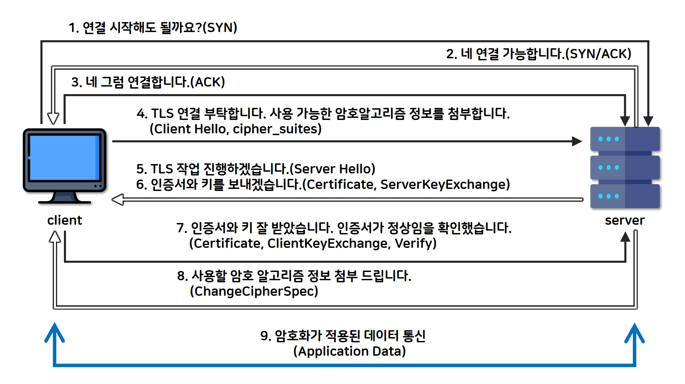
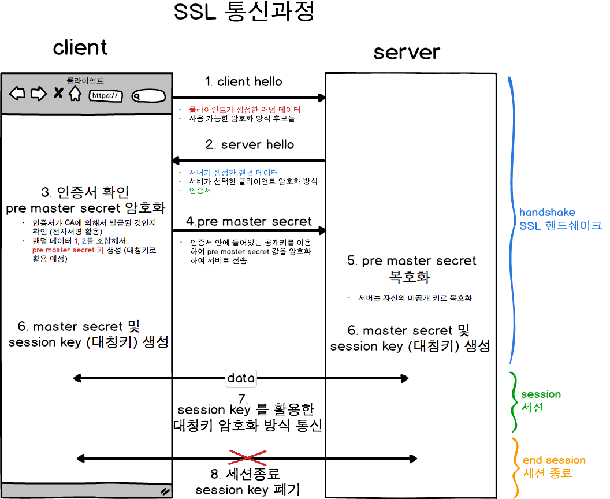
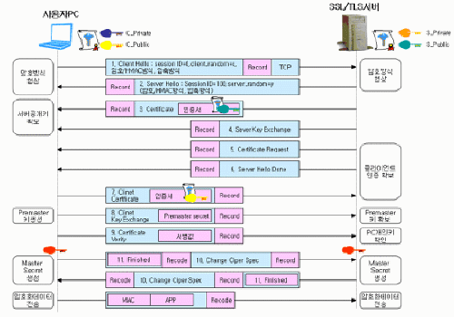

# Web Server Test

## Simple Web Server - We Client

### 1. WebServer-Client

##### WebServer

```go
package main
import (fmt"	"log"	"net/http"	"strconv"	"sync"	"time")
var counter int
var mutex = &sync.Mutex{}

func echoString(w http.ResponseWriter, r *http.Request) {
	log.Printf("[%s][%s][%s][%v]", r.Method, r.Proto, r.URL.Path, r.Header)
	fmt.Fprintf(w, "hello  : ")
	mutex.Lock()
	counter++
	time.Sleep(time.Millisecond * 100)
	mutex.Unlock()
	fmt.Fprintf(w, strconv.Itoa(counter))
	log.Printf("[%s]", strconv.Itoa(counter))
}

func main() {
	mux := http.NewServeMux()
	mux.HandleFunc("/", echoString)		
	mux.HandleFunc("/hi", func(w http.ResponseWriter, r *http.Request) {
		fmt.Fprintf(w, "Hi")
	})

	server := &http.Server{Addr: ":8081", Handler: mux}
	//server.SetKeepAlivesEnabled(false)
	server.ListenAndServe()
	//http.ListenAndServe(":8081", nil)
}
```

##### WebClient

```go
package main

import (	"fmt"	"io/ioutil"	"log"	"net/http")

const (
	URL = "http://192.168.57.31:8081/"
)

func getweb() {
	log.Printf("getweb call")
	req, err := http.NewRequest("GET", URL, nil)
	if err != nil {
		panic(err)
	}
	req.Header.Add("User-Agent", "Crawler")
//	req.Header.Add("Connection", "keep-Alive")
//  req.Header.Add("Keep-Alive", "timeout=5, max=1000")

	client := &http.Client{}
	resp, err := client.Do(req)
	if err != nil {
		panic(err)
	}
	defer resp.Body.Close()

    log.Printf("%v",resp.Header)
	bytes, _ := ioutil.ReadAll(resp.Body)
	str := string(bytes) //바이트를 문자열로
	fmt.Println(str)
}

func main() {
	for i := 0; i < 1000; i++ {
		getweb()
	}
}
```


#### 1. Clinet  keep-Alive 테스트

* ​	client := &http.Client{} 이 코드에서  http 객체를 새롭게 만들기 때문에 keep alive 유지 가 안될 것 같은데... 실제 테스트 해보면 이것과는 무관하게 keep-alive 유지된다.
* Client network 상태

```
$ netstat -na | grep  8081
tcp        0      0 192.168.57.6:50706      192.168.57.31:8081      ESTABLISHED
```

* server network 

```
$ netstat -na |  grep  8081| sort
tcp6       0      0 192.168.57.31:8081      192.168.57.6:50706      ESTABLISHED
tcp6       0      0 :::8081                 :::*                    LISTEN
```


#### 2. Client Header에서 keep-alive 속성 빼고 테스트 

* Client Header에서 두개 속성을 빼도 동일하게 keep-alive 유지된다. 

```
//	req.Header.Add("Connection", "keep-Alive")
//   req.Header.Add("Keep-Alive", "timeout=5, max=1000")
```


#### 3. WebServer에서 server.SetKeepAlivesEnabled(false) 설정

* `	server.SetKeepAlivesEnabled(false)` 설정
* server에서 netwrok 세션이 재활용 안된다. 

```sh
$ netstat -na |  grep  8081| sort
tcp6       0      0 192.168.57.31:8081      192.168.57.6:50712      TIME_WAIT  
tcp6       0      0 192.168.57.31:8081      192.168.57.6:50714      TIME_WAIT  
tcp6       0      0 192.168.57.31:8081      192.168.57.6:50716      TIME_WAIT  
tcp6       0      0 192.168.57.31:8081      192.168.57.6:50718      TIME_WAIT  
tcp6       0      0 192.168.57.31:8081      192.168.57.6:50720      TIME_WAIT  
tcp6       0      0 192.168.57.31:8081      192.168.57.6:50722      TIME_WAIT  
tcp6       0      0 192.168.57.31:8081      192.168.57.6:50724      TIME_WAIT  
tcp6       0      0 192.168.57.31:8081      192.168.57.6:50726      TIME_WAIT  
tcp6       0      0 192.168.57.31:8081      192.168.57.6:50728      TIME_WAIT  
tcp6       0      0 192.168.57.31:8081      192.168.57.6:50730      TIME_WAIT  
tcp6       0      0 192.168.57.31:8081      192.168.57.6:50732      TIME_WAIT  
tcp6       0      0 192.168.57.31:8081      192.168.57.6:50734      TIME_WAIT  
tcp6       0      0 192.168.57.31:8081      192.168.57.6:50736      TIME_WAIT  
tcp6       0      0 192.168.57.31:8081      192.168.57.6:50738      TIME_WAIT  
tcp6       0      0 192.168.57.31:8081      192.168.57.6:50740      TIME_WAIT  
tcp6       0      0 192.168.57.31:8081      192.168.57.6:50742      TIME_WAIT  
tcp6       0      0 192.168.57.31:8081      192.168.57.6:50744      TIME_WAIT  
tcp6       0      0 192.168.57.31:8081      192.168.57.6:50746      TIME_WAIT  
tcp6       0      0 192.168.57.31:8081      192.168.57.6:50748      TIME_WAIT  
tcp6       0      0 192.168.57.31:8081      192.168.57.6:50750      TIME_WAIT  
tcp6       0      0 :::8081                 :::*                    LISTEN  
```


```
C:\Gocode\src>curl -v http://localhost:8081/
*   Trying 127.0.0.1:8081...
* Connected to localhost (127.0.0.1) port 8081 (#0)
> GET / HTTP/1.1
> Host: localhost:8081
> User-Agent: curl/7.83.1
> Accept: */*
>
* Mark bundle as not supporting multiuse
< HTTP/1.1 200 OK
< Date: Sat, 06 Aug 2022 03:35:20 GMT
< Content-Length: 5
< Content-Type: text/plain; charset=utf-8
<
hello* Connection #0 to host localhost left intact

C:\Gocode\src>
```

## 

## Client->ReverseProxy->WebServer

[WebClient] -->[ReverseProxy] -->[WebServer]

* 각 구간에서 Keep-Alive 동작 상태를 확인하려고 함. 
* 잘 동작하네.. !!

##### web Client

```go
package main

import ( "fmt"	"io/ioutil"	"log"	"net/http")

const (
	URL = "http://192.168.57.31:8080/"  //proxy url 
)

func getweb() {
	log.Printf("getweb call")
	req, err := http.NewRequest("GET", URL, nil)
	if err != nil {
		panic(err)
	}
	req.Header.Add("User-Agent", "Crawler")
	client := &http.Client{}
	resp, err := client.Do(req)
	if err != nil {
		panic(err)
	}
	defer resp.Body.Close()

    log.Printf("%v",resp.Header)
	bytes, _ := ioutil.ReadAll(resp.Body)
	str := string(bytes) //바이트를 문자열로
	fmt.Println(str)
}

func main() {
	for i := 0; i < 1000; i++ {
		getweb()
	}
}
```


##### reserse Procy

```go
package main
 
import ( "errors" "fmt"     "log"    "net/http"    "net/http/httputil"    "net/url")
 
// NewProxy takes target host and creates a reverse proxy
func NewProxy(targetHost string) (*httputil.ReverseProxy, error) {
    url, err := url.Parse(targetHost)
    if err != nil {
        return nil, err
    }
 
    proxy := httputil.NewSingleHostReverseProxy(url)
 
    originalDirector := proxy.Director
    proxy.Director = func(req *http.Request) {
        originalDirector(req)
        modifyRequest(req)
    }
 
    //proxy.ModifyResponse = modifyResponse()   //<<-- return 전달위해서 
    //proxy.ErrorHandler = errorHandler()
    return proxy, nil
}
 
func modifyRequest(req *http.Request) {
    req.Header.Set("X-Proxy", "Simple-Reverse-Proxy")
}
 
func errorHandler() func(http.ResponseWriter, *http.Request, error) {
    return func(w http.ResponseWriter, req *http.Request, err error) {
        fmt.Printf("Got error while modifying response: %v \n", err)
        return
    }
}
 
func modifyResponse() func(*http.Response) error {
    return func(resp *http.Response) error {
        return errors.New("response body is invalid")
    }
}
 
// ProxyRequestHandler handles the http request using proxy
func ProxyRequestHandler(proxy *httputil.ReverseProxy) func(http.ResponseWriter, *http.Request) {
    return func(w http.ResponseWriter, r *http.Request) {
        proxy.ServeHTTP(w, r)
    }
}
 
func main() {
    // initialize a reverse proxy and pass the actual backend server url here
    proxy, err := NewProxy("http://192.168.57.31:8081")    //<<-- web server url 
    if err != nil {
        panic(err)
    }
 
    // handle all requests to your server using the proxy
    http.HandleFunc("/", ProxyRequestHandler(proxy))
    log.Fatal(http.ListenAndServe(":8080", nil))
}
```


##### web server

```go
package main
import (fmt"	"log"	"net/http"	"strconv"	"sync"	"time")
var counter int
var mutex = &sync.Mutex{}

func echoString(w http.ResponseWriter, r *http.Request) {
	log.Printf("[%s][%s][%s][%v]", r.Method, r.Proto, r.URL.Path, r.Header)
	fmt.Fprintf(w, "hello  : ")
	mutex.Lock()
	counter++
	time.Sleep(time.Millisecond * 100)
	mutex.Unlock()
	fmt.Fprintf(w, strconv.Itoa(counter))
	log.Printf("[%s]", strconv.Itoa(counter))
}

func main() {
	mux := http.NewServeMux()
	mux.HandleFunc("/", echoString)		
	mux.HandleFunc("/hi", func(w http.ResponseWriter, r *http.Request) {
		fmt.Fprintf(w, "Hi")
	})

	server := &http.Server{Addr: ":8081", Handler: mux}
	//server.SetKeepAlivesEnabled(false)
	server.ListenAndServe()
	//http.ListenAndServe(":8081", nil)
}
```


#### 1. WebClient - Proxy 구간

* keep alive  동작함.

```
$ netstat -na | grep  8080
tcp        0      0 192.168.57.6:35390      192.168.57.31:8080      ESTABLISHED
```


#### 2. proxy-Webserver 구간

* keep-alive 동작하네요. ㅎㅎ


## https

### 1. https 구성










### 2. HTTP 서비스 구성

* http.ListenAndServeTLS
* server.crt
* sver.key

#### ListenAndServeTLS

```go
package main

import (
    "log"
    "net/http"
)

func main() {

    http.Handle("/", http.FileServer(http.Dir("./static")))

    log.Fatal(http.ListenAndServeTLS(":443", "server.crt", "server.key", nil))
}
```


#### Generating Keys

```sh
$ openssl genrsa -out server.key 2048
$ openssl ecparam -genkey -name secp384r1 -out server.key
$ openssl req -new -x509 -sha256 -key server.key -out server.crt -days 3650
```


### 3. Golang Https/TLS

https://gist.github.com/denji/12b3a568f092ab951456

#### 1. Generate private key (.key)

```sh
# Key considerations for algorithm "RSA" ≥ 2048-bit
$ openssl genrsa -out server.key 2048

# Key considerations for algorithm "ECDSA" ≥ secp384r1
# List ECDSA the supported curves (openssl ecparam -list_curves)
$ openssl ecparam -genkey -name secp384r1 -out server.key
```

#### 2. Generation of self-signed(x509) public key (PEM-encodings `.pem`|`.crt`)

 based on the private (`.key`)

```sh
$ openssl req -new -x509 -sha256 -key server.key -out server.crt -days 3650
```

#### 3. simple HTTPS/TLS Server

```go
package main

import (
    // "fmt"
    // "io"
    "net/http"
    "log"
)

func HelloServer(w http.ResponseWriter, req *http.Request) {
    w.Header().Set("Content-Type", "text/plain")
    w.Write([]byte("This is an example server.\n"))
    // fmt.Fprintf(w, "This is an example server.\n")
    // io.WriteString(w, "This is an example server.\n")
}

func main() {
    http.HandleFunc("/hello", HelloServer)
    err := http.ListenAndServeTLS(":443", "server.crt", "server.key", nil)
    if err != nil {
        log.Fatal("ListenAndServe: ", err)
    }
}
```


#### 4. TLS(Transport Layer Security)

##### TLS-Server

```go
package main

import (
    "log"
    "crypto/tls"
    "net"
    "bufio"
)

func main() {
    log.SetFlags(log.Lshortfile)

    cer, err := tls.LoadX509KeyPair("server.crt", "server.key")
    if err != nil {
        log.Println(err)
        return
    }

    config := &tls.Config{Certificates: []tls.Certificate{cer}}
    ln, err := tls.Listen("tcp", ":443", config) 
    if err != nil {
        log.Println(err)
        return
    }
    defer ln.Close()

    for {
        conn, err := ln.Accept()
        if err != nil {
            log.Println(err)
            continue
        }
        go handleConnection(conn)
    }
}

func handleConnection(conn net.Conn) {
    defer conn.Close()
    r := bufio.NewReader(conn)
    for {
        msg, err := r.ReadString('\n')
        if err != nil {
            log.Println(err)
            return
        }

        println(msg)

        n, err := conn.Write([]byte("world\n"))
        if err != nil {
            log.Println(n, err)
            return
        }
    }
}
```


##### TLS-Client

```go
package main

import (
    "log"
    "crypto/tls"
)

func main() {
    log.SetFlags(log.Lshortfile)

    conf := &tls.Config{
         //InsecureSkipVerify: true,
    }

    conn, err := tls.Dial("tcp", "127.0.0.1:443", conf)
    if err != nil {
        log.Println(err)
        return
    }
    defer conn.Close()

    n, err := conn.Write([]byte("hello\n"))
    if err != nil {
        log.Println(n, err)
        return
    }

    buf := make([]byte, 100)
    n, err = conn.Read(buf)
    if err != nil {
        log.Println(n, err)
        return
    }

    println(string(buf[:n]))
}
```


#### 5. Perfect SSL 

```go
package main

import (
    "crypto/tls"
    "log"
    "net/http"
)

func main() {
    mux := http.NewServeMux()
    mux.HandleFunc("/", func(w http.ResponseWriter, req *http.Request) {
        w.Header().Add("Strict-Transport-Security", "max-age=63072000; includeSubDomains")
        w.Write([]byte("This is an example server.\n"))
    })
    cfg := &tls.Config{
        MinVersion:               tls.VersionTLS12,
        CurvePreferences:         []tls.CurveID{tls.CurveP521, tls.CurveP384, tls.CurveP256},
        PreferServerCipherSuites: true,
        CipherSuites: []uint16{
            tls.TLS_ECDHE_RSA_WITH_AES_256_GCM_SHA384,
            tls.TLS_ECDHE_RSA_WITH_AES_256_CBC_SHA,
            tls.TLS_RSA_WITH_AES_256_GCM_SHA384,
            tls.TLS_RSA_WITH_AES_256_CBC_SHA,
        },
    }
    srv := &http.Server{
        Addr:         ":443",
        Handler:      mux,
        TLSConfig:    cfg,
        TLSNextProto: make(map[string]func(*http.Server, *tls.Conn, http.Handler), 0),
    }
    log.Fatal(srv.ListenAndServeTLS("tls.crt", "tls.key"))
}
```


```sh
# ECDSA recommendation key ≥ secp384r1
# List ECDSA the supported curves (openssl ecparam -list_curves)
openssl req -x509 -nodes -newkey ec:secp384r1 -keyout server.ecdsa.key -out server.ecdsa.crt -days 3650
# openssl req -x509 -nodes -newkey ec:<(openssl ecparam -name secp384r1) -keyout server.ecdsa.key -out server.ecdsa.crt -days 3650
# -pkeyopt ec_paramgen_curve:… / ec:<(openssl ecparam -name …) / -newkey ec:…
ln -sf server.ecdsa.key server.key
ln -sf server.ecdsa.crt server.crt

# RSA recommendation key ≥ 2048-bit
openssl req -x509 -nodes -newkey rsa:2048 -keyout server.rsa.key -out server.rsa.crt -days 3650
ln -sf server.rsa.key server.key
ln -sf server.rsa.crt server.crt
```

https://gist.github.com/denji/12b3a568f092ab951456


#### 6. Disable Security Check HTTPS(SSL)

```go
 package main

 import (
         "crypto/tls"
         "fmt"
         "io/ioutil"
         "net/http"
         "os"
 )

 func main() {
         transCfg := &http.Transport{
                 TLSClientConfig: &tls.Config{InsecureSkipVerify: true},
         }
         client := &http.Client{Transport: transCfg}

         response, err := client.Get("https://socketloop.com/")

         if err != nil {
                 fmt.Println(err)
                 os.Exit(1)
         }

         defer response.Body.Close()

         htmlData, err := ioutil.ReadAll(response.Body)

         if err != nil {
                 fmt.Println(err)
                 os.Exit(1)
         }

         fmt.Println(os.Stdout, string(htmlData))
 }
```


#### 7. requeset

```go
//doRequest ...
func (c *NetappClient) doRequest(method, url string, in, out interface{}) (http.Header, error) {
	//c.log.Debugf("[%+v] [%+v]", method , url)
	var inbody []byte
	var body *bytes.Buffer
	var req *http.Request
	if in != nil {
		inbody, _ = json.Marshal(in)
		body = bytes.NewBuffer(inbody)
		req, _ = http.NewRequest(method, url, body)
	} else {
		req, _ = http.NewRequest(method, url, nil)
	}
	req.Header.Add("Content-Type", "application/json")
	tr := &http.Transport{
		TLSClientConfig: &tls.Config{InsecureSkipVerify: true},
	}
	client := http.Client{Transport: tr}
	resp, errReq := client.Do(req)

	if errReq != nil {
            msg := fmt.Sprintf("doRequest failed: [%+v]", errReq)
			c.log.Error(msg)
			return nil, errors.New(msg) 

	}
	defer resp.Body.Close()

	buf, err := ioutil.ReadAll(resp.Body)
	if err != nil {
		c.log.Error(err)
	}

	inErr := &ArrayInnerErrorBody{}
	json.Unmarshal([]byte(buf), inErr)
	if len(inErr.Errs) != 0 {
		c.log.Errorf("[%+v]", inErr)
		return resp.Header, nil
	}

	if out != nil {
		err := json.Unmarshal([]byte(buf), out)
		if err != nil {
			c.log.Debug(string(buf))
			c.log.Error(err)
		}
	}

	return resp.Header, nil
}
```

